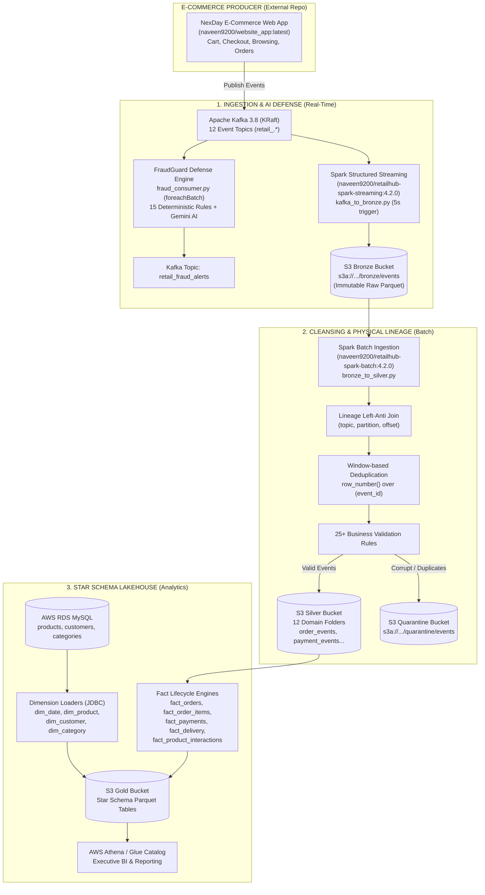

# RetailHub Data Platform 🚀
### Real-Time Streaming Ingestion, AI Fraud Defense & Medallion Lakehouse on AWS

[](https://spark.apache.org/)
[-231F20?logo=apachekafka&logoColor=white)](https://kafka.apache.org/)
[](https://aws.amazon.com/)
[](https://www.terraform.io/)
[](https://hub.docker.com/u/naveen9200)
[](https://www.python.org/)
[](https://airflow.apache.org/)
[](https://deepmind.google/technologies/gemini/)

An enterprise-grade, cloud-native **Medallion Data Lakehouse (Bronze → Silver → Gold)** and **Real-Time Streaming Engine** built with **PySpark 4.2.0**, **Apache Kafka (KRaft)**, **AWS**, and **Docker**.

The platform captures high-velocity e-commerce events, conducts sub-second deterministic fraud detection with **Gemini AI** risk explanation, cleanses and deduplicates records with strict physical Kafka lineage, and models data into a Kimball Star Schema for business intelligence and executive analytics.

---

## 📑 Table of Contents
1. [System Architecture](#-system-architecture)
2. [E-Commerce Web Application (NexDay Platform)](#-e-commerce-web-application-nexday-platform)
3. [Docker Hub Container Ecosystem](#-docker-hub-container-ecosystem)
4. [Medallion Architecture & Pipelines](#-medallion-architecture--pipelines)
   - [Bronze Streaming (Kafka → S3 Bronze)](#1-layer-1-bronze-streaming-ingestion-kafka--s3)
   - [Real-Time FraudGuard Defense Engine](#2-layer-15-real-time-ai-fraudguard-defense)
   - [Silver Cleansing & Deduplication (Bronze → S3 Silver)](#3-layer-2-silver-cleansing--deduplication)
   - [Gold Dimensional Modeling (Kimball Star Schema)](#4-layer-3-gold-dimensional-modeling-star-schema)
5. [Repository Structure](#-repository-structure)
6. [AWS Infrastructure Automation (Terraform)](#-aws-infrastructure-automation-terraform)
7. [Getting Started & Runbook](#-getting-started--runbook)
   - [Local Quickstart (Docker Compose)](#local-quickstart-docker-compose)
   - [AWS Cloud Execution](#aws-cloud-execution)
8. [Environment Configuration (.env)](#-environment-configuration-env)
9. [Engineering Handbook & Documentation](#-engineering-handbook--documentation)

---

## 🏛 System Architecture



---

## 🌐 E-Commerce Web Application (NexDay Platform)

The producer application generating live e-commerce clickstream and transaction traffic is **RetailHub NexDay**, hosted in a dedicated repository:

* **Repository Location**: Separate standalone repository (`retailhub-nexday` / `website_app`).
* **Docker Image**: [`naveen9200/website_app:latest`](https://hub.docker.com/r/naveen9200/website_app)
* **Technology**: Modern Full-Stack Web Platform (Node.js/Next.js/Python backend) with direct Kafka event instrumentation.
* **Integration**: The web app communicates directly with Apache Kafka on port `9092` (external) or `29092` (internal Docker network). Every user interaction—searching products, adding items to carts, applying coupons, initiating checkouts, submitting payments, or rating items—emits typed JSON messages into RetailHub's Kafka event topics.

---

## 🐳 Docker Hub Container Ecosystem

All components are containerized, optimized, and published to Docker Hub:

| Container Image | Tag | Docker Hub URI | Purpose / Responsibilities |
| :--- | :--- | :--- | :--- |
| **Spark Streaming** | `4.2.0`, `latest` | [`naveen9200/retailhub-spark-streaming`](https://hub.docker.com/r/naveen9200/retailhub-spark-streaming) | Runs `kafka_to_bronze.py` Structured Streaming and `fraud_consumer.py` real-time AI security engine. Built on Java 21 LTS & Spark 4.2.0. |
| **Spark Batch** | `4.2.0`, `latest` | [`naveen9200/retailhub-spark-batch`](https://hub.docker.com/r/naveen9200/retailhub-spark-batch) | Executes `bronze_to_silver.py` cleansing, lineage anti-joins, and all 9 Gold Star Schema batch transformations (`dim_*`, `fact_*`). |
| **NexDay Web App** | `latest` | [`naveen9200/website_app`](https://hub.docker.com/r/naveen9200/website_app) | Complete e-commerce store with catalog browsing, shopping cart, customer checkout, and live Kafka event producers. |
| **Apache Kafka** | `latest` | `apache/kafka:latest` | High-throughput distributed message broker running in **KRaft** mode (no ZooKeeper dependency). |

> **Docker Optimization Note**: The Spark Dockerfiles strip redundant 450MB pip-reinstalled PySpark binaries from the base `apache/spark:4.2.0-python3` image, cutting image build time by 70% and drastically reducing EC2 pull latency.

---

## 🔄 Medallion Architecture & Pipelines

### 1. Layer 1: Bronze Streaming Ingestion (Kafka → S3)
* **File**: [`src/streaming/kafka_to_bronze.py`](src/streaming/kafka_to_bronze.py)
* **Engine**: Spark Structured Streaming with micro-batch trigger (`processingTime="5 seconds"`).
* **Topic Subscription**: Dynamic regex pattern `retail_.*` capturing all 12 operational Kafka topics.
* **Physical Lineage**: Every event extracts its exact physical coordinates: `topic`, `partition`, `offset`, `kafka_timestamp`, `kafka_key`, and appends `bronze_ingestion_time` via `current_timestamp()`.
* **Immutability Guarantee**: Raw payload is preserved untouched as `event_json` in append-only Snappy Parquet.
* **Fault Tolerance**: Checkpoints maintained in S3 (`s3a://.../checkpoints/bronze`).

### 2. Layer 1.5: Real-Time AI FraudGuard Defense
* **File**: [`src/streaming/fraud_consumer.py`](src/streaming/fraud_consumer.py)
* **Engine**: Structured Streaming `readStream` + `foreachBatch` bounded memory engine.
* **Backpressure**: `maxOffsetsPerTrigger=5000` caps batch size during traffic bursts.
* **15 Deterministic Fraud Rules**:
  1. `CARD_TESTING`: ≥ 3 failed transactions in 5 minutes.
  2. `PAYMENT_VELOCITY`: > 4 payment attempts in 10 minutes on a single account.
  3. `MULTI_ACCOUNT_IP`: > 3 customer accounts operating from a single IP.
  4. `ACCOUNT_TAKEOVER`: Authentication failures followed by immediate credential change.
  5. `NEW_DEVICE_SENSITIVE`: Address/profile modification on unrecorded device fingerprint.
  6. `COUPON_ABUSE`: Single promo code redeemed across disparate accounts.
  7. `HIGH_VALUE_BURST`: Order amount > $1,000 and 2× customer baseline.
  8. `IMPOSSIBLE_TRAVEL`: Velocity between consecutive logins exceeds 800 km/h.
  9. `REFUND_ABUSE`: > 3 return requests within 7 days.
  10. `SESSION_HIJACK`: IP address changed mid-session.
  11. `BOT_CART_HOARDING`: > 20 items reserved in cart in < 60 seconds.
  12. `ADDRESS_MISMATCH`: Billing state ≠ Shipping state discrepancy.
  13. `OFF_HOURS_ADMIN`: Administrative privileges exercised between 00:00–05:00 UTC.
  14. `CHARGEBACK_CLUSTER`: Hardware device linked to historical payment chargebacks.
  15. `SYNTHETIC_IDENTITY`: Disposable temporary email domain paired with VOIP telephone.
* **Gemini AI Integration**: High-risk alerts invoke **Google Gemini 2.5 Flash** asynchronously to produce structured risk synopses (0–100 score) emitted to `retail_fraud_alerts`.

### 3. Layer 2: Silver Cleansing & Deduplication
* **File**: [`src/silver/bronze_to_silver.py`](src/silver/bronze_to_silver.py)
* **Incremental Lineage Anti-Join**: Reads historical coordinates `(topic, partition, offset)` from existing Silver domain folders and Quarantine. Executes `left_anti` join against Bronze, guaranteeing that only new, unprocessed records are parsed.
* **Deep Schema Parsing**: Unpacks `event_json` using nested `event_schema` into `context` (device, IP, geo), `entity` (IDs), and `metadata` (amounts, prices).
* **Latency Features**: Computes `event_arrival_lag_seconds` and `producer_ingestion_lag_seconds`.
* **Multi-Layer Deduplication**: Window function `row_number() over (partitionBy event_id orderBy kafka_timestamp desc, offset desc)` isolates duplicates. Cross-run checks prevent re-ingestion.
* **25+ Quarantine Rules**: Corrupt JSON, negative prices, missing foreign keys, and invalid ratings (outside 1..5) route to `s3a://.../quarantine/events`.
* **12 Domain Folders**: Clean events route to `order_events`, `payment_events`, `delivery_events`, `fulfillment_events`, `cart_events`, `discovery_events`, `checkout_events`, `coupon_events`, `return_events`, `user_events`, `admin_events`, and `system_events`.
* **Reconciliation Invariant**: Strictly enforces `valid_count + quarantine_count == new_bronze_count`.

### 4. Layer 3: Gold Dimensional Modeling (Star Schema)
* **The 4 Dimensions**:
  * [`dim_date.py`](src/gold/dim_date.py): Algorithmic calendar generation (2020–2030) with `date_key`, year, quarter, month, day, is_weekend, fiscal periods.
  * [`dim_product.py`](src/gold/dim_product.py): AWS RDS MySQL JDBC read of `products` master. SCD Type 1 attributes, brand, pricing tiers.
  * [`dim_customer.py`](src/gold/dim_customer.py): AWS RDS MySQL JDBC read of `customers`. PII sanitized (`email_hash`), demographic segments.
  * [`dim_category.py`](src/gold/dim_category.py): Category & subcategory taxonomy hierarchy from RDS MySQL.
* **The 5 Facts**:
  * [`fact_orders.py`](src/gold/fact_orders.py): Order lifecycle fact. Joins 4 Silver domains. Computes cycle latency (`order_to_payment_seconds`, `order_to_ship_seconds`, `order_to_delivery_seconds`) and financial integrity. Cached in-memory upsert overwrite.
  * [`fact_order_items.py`](src/gold/fact_order_items.py): Line item grain. Combines 6 Silver domains. Computes item line totals, tax, allocated discounts, return statuses.
  * [`fact_payments.py`](src/gold/fact_payments.py): Payment lifecycle fact (`initiated` → `retry` → `success`/`failed`/`refund`). Chronology validation and gateway breakdown.
  * [`fact_delivery.py`](src/gold/fact_delivery.py): Shipment milestone tracking (`in_transit`, `out_for_delivery`, `delivered`, `failed`). Carrier transit latency and SLA fulfillment.
  * [`fact_product_interactions.py`](src/gold/fact_product_interactions.py): Clickstream behavioral fact. Combines `discovery_events` and `cart_events`. Conversion funnels, search rank positions, CTR.

---

## 📂 Repository Structure

```text
RetailHub-Spark/
├── .env.example.aws                  # Reference environment variables for AWS
├── README.md                         # Project documentation and architectural manual
├── requirements.txt                  # Python dependencies
├── RetailHub_Engineering_Handbook.pdf# Compiled 16-page engineering handbook
├── RetailHub_Spark_Medallion_Architecture_Handbook.pdf # 10-page deep-dive PDF
│
├── docker/                           # Optimized Docker image specifications
│   ├── spark-streaming/
│   │   └── Dockerfile               # Spark 4.2.0 + Kafka + FraudGuard container
│   └── spark-batch/
│       └── Dockerfile               # Spark 4.2.0 + MySQL JDBC + Batch pipelines container
│
├── fraudguard/                       # Real-time AI security & rules engine
│   ├── rules/                       # Deterministic fraud rules
│   └── explainer.py                 # Google Gemini 2.5 Flash LLM integration
│
├── src/                              # Core data engineering source code
│   ├── config/
│   │   └── settings.py              # Centralized environment & path resolver
│   ├── schemas/
│   │   └── event_schema.py          # Canonical e-commerce JSON schema
│   ├── streaming/
│   │   ├── kafka_to_bronze.py       # Spark Structured Streaming (Kafka -> S3 Bronze)
│   │   ├── fraud_consumer.py        # Real-time FraudGuard stream processing
│   │   └── docker-compose.yml       # Local Kafka (KRaft) & streaming orchestration
│   ├── silver/
│   │   └── bronze_to_silver.py      # Cleansing, lineage anti-join, dedup & quarantine
│   └── gold/
│       ├── dim_date.py              # Calendar dimension generator (2020-2030)
│       ├── dim_product.py           # Product dimension (RDS MySQL JDBC)
│       ├── dim_customer.py          # Customer dimension (RDS MySQL JDBC)
│       ├── dim_category.py          # Category taxonomy dimension (RDS MySQL JDBC)
│       ├── fact_orders.py           # Order lifecycle fact table
│       ├── fact_order_items.py      # Order line-item fact table
│       ├── fact_payments.py         # Payment transaction fact table
│       ├── fact_delivery.py         # Logistics & delivery SLA fact table
│       └── fact_product_interactions.py # Clickstream behavioral analytics fact table
│
├── airflow/                          # Workflow orchestration
│   └── dags/
│       └── gold_dag.py              # Airflow DAG coordinating Silver & Gold dependencies
│
└── terraform/                        # Complete AWS Cloud Infrastructure as Code
    ├── main.tf                      # Terraform module wiring
    ├── variables.tf                 # Cloud input variables
    ├── outputs.tf                   # ALB DNS, RDS endpoint, S3 bucket outputs
    ├── modules/
    │   ├── vpc/                     # Custom VPC, 2 AZs, public/private subnets, NAT
    │   ├── alb/                     # Internet-facing Application Load Balancer
    │   ├── ec2/                     # 5 Private EC2 Instances (Web, Kafka, Stream, Batch, Airflow)
    │   ├── rds/                     # Multi-AZ MySQL RDS instance
    │   ├── s3/                      # 5 Encrypted S3 Buckets (Bronze, Silver, Gold, Quarantine, Checkpoints)
    │   ├── iam/                     # IAM roles with least-privilege S3/SSM permissions
    │   ├── security_groups/         # Zero-trust security groups
    │   └── athena/                  # Glue Database & Athena Workgroup
    └── scripts/
        ├── bootstrap_web.sh         # EC2 User Data for Web App
        ├── bootstrap_kafka.sh       # EC2 User Data for Kafka broker
        ├── bootstrap_streaming.sh   # EC2 User Data for Streaming workers
        ├── bootstrap_batch.sh       # EC2 User Data for Spark Batch
        └── bootstrap_airflow.sh     # EC2 User Data for Airflow workers
```

---

## ☁️ AWS Infrastructure Automation (Terraform)

The cloud environment is provisioned with modular Terraform (`terraform/`):
* **Networking**: Custom VPC across 2 Availability Zones (`us-east-1a`, `us-east-1b`) with Public & Private Subnets, Internet Gateway, and NAT Gateway.
* **Security**: Zero-trust Security Groups; all compute instances reside in **private subnets** with zero public IP addresses. Management access is secured through **AWS Systems Manager (SSM) Session Manager** (no open SSH port 22).
* **Storage**: 5 S3 Buckets with Server-Side Encryption (SSE-S3), Bucket Ownership Controls, and Public Access Block:
  - `retailhub-bronze-<id>`
  - `retailhub-silver-<id>`
  - `retailhub-gold-<id>`
  - `retailhub-quarantine-<id>`
  - `retailhub-checkpoints-<id>`
* **Database**: Amazon RDS MySQL Multi-AZ database hosting operational `products`, `customers`, and `categories` tables.
* **Compute**: 5 specialized EC2 instances bootstrapped via automated User Data scripts pulling pre-built Docker Hub images.

---

## 🚀 Getting Started & Runbook

### Local Quickstart (Docker Compose)

1. **Clone the repository**:
   ```bash
   git clone https://github.com/<your-username>/RetailHub-Spark.git
   cd RetailHub-Spark
   ```

2. **Configure Environment**:
   ```bash
   cp .env.example.aws .env
   # Edit .env with your local or cloud paths
   ```

3. **Start Kafka (KRaft mode) & NexDay Web App**:
   ```bash
   docker compose -f src/streaming/docker-compose.yml up -d
   ```
   * Kafka Broker starts on `localhost:9092`.
   * Topic initializer creates all 12 `retail_.*` topics automatically.
   * NexDay Web App is accessible at `http://localhost:5000`.

4. **Launch Spark Structured Streaming (Bronze Ingestion)**:
   ```bash
   docker run -d --name retailhub-streaming \
     --network host \
     --env-file .env \
     naveen9200/retailhub-spark-streaming:4.2.0 \
     spark-submit /opt/retailhub/src/streaming/kafka_to_bronze.py
   ```

5. **Generate E-Commerce Events**:
   Open `http://localhost:5000` in your browser. Browse products, add items to cart, and complete orders.

6. **Execute Silver Cleansing Batch**:
   ```bash
   docker run --rm \
     --network host \
     --env-file .env \
     naveen9200/retailhub-spark-batch:4.2.0 \
     spark-submit /opt/retailhub/src/silver/bronze_to_silver.py
   ```

7. **Execute Gold Star Schema Builds**:
   ```bash
   # Dimensions
   docker run --rm --network host --env-file .env naveen9200/retailhub-spark-batch:4.2.0 spark-submit /opt/retailhub/src/gold/dim_date.py
   docker run --rm --network host --env-file .env naveen9200/retailhub-spark-batch:4.2.0 spark-submit /opt/retailhub/src/gold/dim_product.py
   docker run --rm --network host --env-file .env naveen9200/retailhub-spark-batch:4.2.0 spark-submit /opt/retailhub/src/gold/dim_customer.py

   # Fact Tables
   docker run --rm --network host --env-file .env naveen9200/retailhub-spark-batch:4.2.0 spark-submit /opt/retailhub/src/gold/fact_orders.py
   docker run --rm --network host --env-file .env naveen9200/retailhub-spark-batch:4.2.0 spark-submit /opt/retailhub/src/gold/fact_order_items.py
   docker run --rm --network host --env-file .env naveen9200/retailhub-spark-batch:4.2.0 spark-submit /opt/retailhub/src/gold/fact_payments.py
   docker run --rm --network host --env-file .env naveen9200/retailhub-spark-batch:4.2.0 spark-submit /opt/retailhub/src/gold/fact_delivery.py
   docker run --rm --network host --env-file .env naveen9200/retailhub-spark-batch:4.2.0 spark-submit /opt/retailhub/src/gold/fact_product_interactions.py
   ```

---

### AWS Cloud Execution

1. **Deploy Cloud Infrastructure with Terraform**:
   ```bash
   cd terraform
   terraform init
   terraform plan -out=tfplan
   terraform apply tfplan
   ```

2. **Connect via AWS SSM (No SSH Key Needed)**:
   ```bash
   aws ssm start-session --target <EC2-INSTANCE-ID>
   ```

3. **Trigger Scheduled Pipelines via Apache Airflow**:
   Navigate to the Airflow Web UI on the Airflow EC2 instance (or port-forward via SSM):
   ```bash
   aws ssm start-session --target <AIRFLOW-EC2-ID> --document-name AWS-StartPortForwardingSession --parameters '{"portNumber":["8080"],"localPortNumber":["8080"]}'
   ```
   Open `http://localhost:8080` and unpause `gold_dag`.

---

## ⚙️ Environment Configuration (.env)

| Environment Variable | Description | Example (AWS Production) | Example (Local Dev) |
| :--- | :--- | :--- | :--- |
| `KAFKA_BROKER` | Kafka bootstrap broker connection string | `10.0.139.252:9092` | `localhost:9092` |
| `BRONZE_PATH` | S3 URI for raw Bronze Parquet files | `s3a://retailhub-bronze-252bda/events` | `./data/bronze` |
| `SILVER_PATH` | S3 URI for cleansed Silver domain folders | `s3a://retailhub-silver-252bda/events` | `./data/silver` |
| `GOLD_PATH` | S3 URI for Star Schema Gold tables | `s3a://retailhub-gold-252bda/tables` | `./data/gold` |
| `QUARANTINE_PATH` | S3 URI for corrupt / duplicate events | `s3a://retailhub-quarantine-252bda/events` | `./data/quarantine` |
| `BRONZE_CHECKPOINT_PATH` | S3 URI for streaming ingestion checkpoint | `s3a://retailhub-checkpoints-252bda/bronze` | `./checkpoints/bronze` |
| `FRAUD_CHECKPOINT_PATH` | S3 URI for FraudGuard checkpoint | `s3a://retailhub-checkpoints-252bda/fraud` | `./checkpoints/fraud` |
| `MYSQL_HOST` | Amazon RDS MySQL endpoint | `retailhub-db.cz8...rds.amazonaws.com` | `localhost` |
| `MYSQL_DATABASE` | Operational MySQL database name | `retailhub` | `retailhub` |
| `MYSQL_USER` | MySQL database username | `admin` | `root` |
| `MYSQL_PASSWORD` | MySQL database password | `******` | `******` |
| `GEMINI_API_KEY` | Google Gemini API key for AI Fraud Explainer | `AIzaSy...` | `AIzaSy...` |

---

## 📚 Engineering Handbook & Documentation

This repository includes comprehensive, standalone PDF engineering documentation compiled directly from the codebase:

1. [**`RetailHub_Spark_Medallion_Architecture_Handbook.pdf`**](RetailHub_Spark_Medallion_Architecture_Handbook.pdf): 10-page deep-dive manual covering the exact mathematical invariants, window deduplication mechanics, operational dry runs, and "how and how many" technical inventory.
2. [**`RetailHub_Engineering_Handbook.pdf`**](RetailHub_Engineering_Handbook.pdf): 16-page full-stack cloud operations book covering Terraform infrastructure, security configurations, and container architectures.

---

## 📄 License
This project is licensed under the Apache 2.0 License - see the LICENSE file for details.

