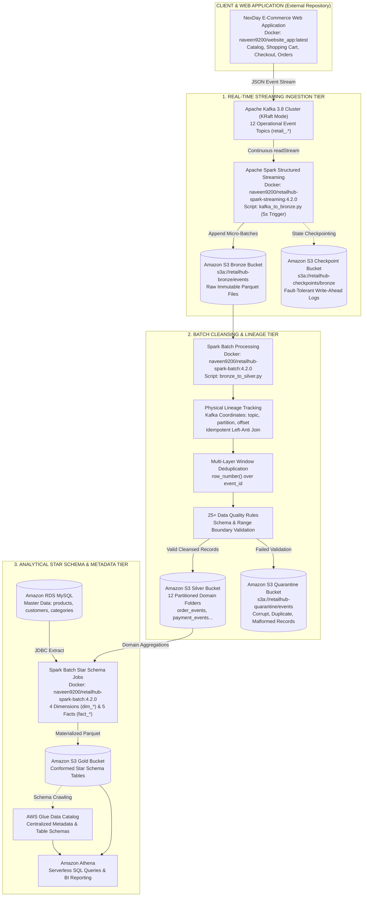

# RetailHub Data Platform 
### Real-Time Spark Structured Streaming & Medallion Lakehouse on AWS

[](https://spark.apache.org/)
[](https://spark.apache.org/docs/latest/structured-streaming-programming-guide.html)
[-231F20?logo=apachekafka&logoColor=white)](https://kafka.apache.org/)
[](https://aws.amazon.com/)
[](https://aws.amazon.com/athena/)
[](https://hub.docker.com/u/naveen9200)
(https://hub.docker.com/r/naveen9200/)
[](https://www.python.org/)
[](https://airflow.apache.org/)

An enterprise-grade, cloud-native **Medallion Data Lakehouse (Bronze → Silver → Gold)** and **Real-Time Streaming Platform** built with **PySpark 4.2.0**, **Apache Kafka (KRaft)**, and **Amazon Web Services (AWS)**.

The platform continuously streams live e-commerce clickstream and transaction events via **Spark Structured Streaming**, preserves immutable raw data in S3 Bronze, cleanses and deduplicates records with physical Kafka offset lineage in S3 Silver, and models analytical datasets into a **Kimball Star Schema** in S3 Gold cataloged by **AWS Glue** and queried with **Amazon Athena**.

---

## Related Repositories

### ETL Data Pipeline Repository
The batch and streaming ETL pipeline for processing historical clickstream telemetry, data warehouse transformations, and analytics modeling is hosted in a separate dedicated repository:

**[RetailHub ETL Data Pipeline Repository](https://github.com/naveenkumark2830-spec/RetailHub-E-Commerce-Webiste)**  
*URL*: `https://github.com/naveenkumark2830-spec/RetailHub-E-Commerce-Webiste`

---

## Table of Contents
1. [System Architecture](#-system-architecture)
2. [E-Commerce Web Application (NexDay Platform)](#-e-commerce-web-application-nexday-platform)
3. [AWS Cloud Infrastructure & Services](#-aws-cloud-infrastructure--services)
4. [Docker Hub Container Ecosystem](#-docker-hub-container-ecosystem)
5. [How to Pull & Run Docker Images on AWS](#-how-to-pull--run-docker-images-on-aws)
6. [Data Processing Layers & Pipelines](#-data-processing-layers--pipelines)
   - [Spark Structured Streaming (Kafka → S3 Bronze)](#1-spark-structured-streaming-ingestion-kafka--s3-bronze)
   - [Silver Cleansing & Deduplication (Bronze → S3 Silver)](#2-silver-cleansing-lineage--deduplication-batch)
   - [Gold Dimensional Modeling (Kimball Star Schema)](#3-gold-dimensional-modeling-star-schema)
7. [Repository Structure](#-repository-structure)
8. [Environment Configuration (.env)](#-environment-configuration-env)
9. [Engineering Documentation](#-engineering-documentation)

---

##  System Architecture



---

## E-Commerce Web Application (NexDay Platform)

The event-producing frontend for this data platform is **RetailHub NexDay**, hosted in a dedicated repository:

* **Repository Location**: Separate standalone repository (`retailhub-nexday` / `website_app`).
* **Docker Hub Image**: [`naveen9200/website_app:latest`](https://hub.docker.com/r/naveen9200/website_app)
* **Technology**: Modern Full-Stack Web Platform (Node.js/Next.js/Python backend) with native event instrumentation.
* **Kafka Integration**: The application connects to Apache Kafka on port `9092` (host/EC2) or `29092` (internal Docker network). Every user interaction—searching products, adding items to carts, applying coupons, submitting payments, or rating items—publishes typed JSON messages across RetailHub's 12 event topics.

---

## AWS Cloud Infrastructure & Services

The platform is designed around AWS cloud services with zero-trust networking:

| AWS Service | Component Role | Architectural Purpose & Implementation |
| :--- | :--- | :--- |
| **IAM Roles & Policies** | Security & Auth | EC2 instances use **IAM Instance Profiles**. Uses `AmazonSSMManagedInstanceCore` for secure shell access without SSH (port 22 closed). Least-privilege S3 bucket policies allow Spark to read and write without hardcoded AWS access keys. |
| **Amazon EC2** | Compute Tier | Private subnet EC2 instances running Dockerized workers: Web App, Kafka broker, Spark Streaming, Spark Batch, and Apache Airflow. |
| **Application Load Balancer (ALB)** | Ingress Traffic | Internet-facing ALB in public subnets routing HTTP/HTTPS web traffic directly to the NexDay web container on port `5000` in the private subnet. |
| **Amazon S3** | Data Lake Storage | 5 Server-Side Encrypted (SSE-S3) buckets: `retailhub-bronze`, `retailhub-silver`, `retailhub-gold`, `retailhub-quarantine`, and `retailhub-checkpoints`. |
| **Amazon RDS MySQL** | Relational Master | Multi-AZ MySQL database storing operational transactional master data: `products`, `customers`, and `categories`. |
| **AWS Glue Data Catalog** | Metadata Catalog | Centralized metadata metastore maintaining schemas, partitions, and data types for Bronze, Silver, and Gold Parquet datasets. |
| **Amazon Athena** | Serverless SQL | Interactive serverless query engine allowing analysts to run SQL queries directly on S3 Gold Parquet tables using Glue catalog metadata. |

---

##  Docker Hub Container Ecosystem

All images are pre-built, hardened, and pushed to Docker Hub:

| Container Image | Version / Tag | Docker Hub Repository | Description |
| :--- | :--- | :--- | :--- |
| **Spark Streaming** | `4.2.0`, `latest` | [`naveen9200/retailhub-spark-streaming`](https://hub.docker.com/r/naveen9200/retailhub-spark-streaming) | Runs Spark Structured Streaming ingestion (`kafka_to_bronze.py`). Built on Java 21 LTS and Apache Spark 4.2.0. |
| **Spark Batch** | `4.2.0`, `latest` | [`naveen9200/retailhub-spark-batch`](https://hub.docker.com/r/naveen9200/retailhub-spark-batch) | Executes `bronze_to_silver.py` and all 9 Gold Star Schema batch transformations (`dim_*`, `fact_*`). Includes MySQL JDBC driver. |
| **NexDay Web App** | `latest` | [`naveen9200/website_app`](https://hub.docker.com/r/naveen9200/website_app) | Full-stack e-commerce web platform generating live customer events into Kafka topics. |
| **Apache Kafka** | `latest` | `apache/kafka:latest` | Distributed streaming broker running in **KRaft** mode (no ZooKeeper dependency). |

---
## How to Pull & Run Docker Images on AWS

### 1. Connect to your EC2 Instance via AWS SSM
Because all EC2 instances are in private subnets with no public SSH access, connect using **AWS Systems Manager (SSM)**:
```bash
aws ssm start-session --target <EC2-INSTANCE-ID>
```

### 2. Verify Docker is Running on EC2
```bash
sudo systemctl status docker
```

### 3. Pull the Docker Images from Docker Hub
Pull the pre-built images directly on your AWS EC2 instance:
```bash
# Pull Spark Streaming Image
docker pull naveen9200/retailhub-spark-streaming:4.2.0

# Pull Spark Batch Image
docker pull naveen9200/retailhub-spark-batch:4.2.0

# Pull NexDay E-Commerce Web Application
docker pull naveen9200/website_app:latest

# Pull Apache Kafka (KRaft)
docker pull apache/kafka:latest
```

### 4. Running the Spark Streaming Job on AWS
Because the EC2 instance has an **IAM Role** attached with S3 permissions, Spark uses AWS Hadoop's `DefaultAWSCredentialsProviderChain` automatically—**no AWS keys are needed in the container environment**:
```bash
docker run -d --name retailhub-streaming \
  --restart unless-stopped \
  -e KAFKA_BROKER=10.0.139.252:9092 \
  -e BRONZE_PATH=s3a://retailhub-bronze-252bda/events \
  -e BRONZE_CHECKPOINT_PATH=s3a://retailhub-checkpoints-252bda/bronze \
  naveen9200/retailhub-spark-streaming:4.2.0 \
  spark-submit /opt/retailhub/src/streaming/kafka_to_bronze.py
```

### 5. Running the Spark Batch Silver Pipeline on AWS
```bash
docker run --rm \
  --env-file /opt/retailhub-batch/.env \
  -e BRONZE_PATH=s3a://retailhub-bronze-252bda/events \
  -e SILVER_PATH=s3a://retailhub-silver-252bda/events \
  -e QUARANTINE_PATH=s3a://retailhub-quarantine-252bda/events \
  naveen9200/retailhub-spark-batch:4.2.0 \
  spark-submit /opt/retailhub/src/silver/bronze_to_silver.py
```

### 6. Running Gold Fact & Dimension Builds on AWS
```bash
# Build Dimensions (from MySQL RDS via JDBC)
docker run --rm --env-file /opt/retailhub-batch/.env naveen9200/retailhub-spark-batch:4.2.0 spark-submit /opt/retailhub/src/gold/dim_date.py
docker run --rm --env-file /opt/retailhub-batch/.env naveen9200/retailhub-spark-batch:4.2.0 spark-submit /opt/retailhub/src/gold/dim_product.py
docker run --rm --env-file /opt/retailhub-batch/.env naveen9200/retailhub-spark-batch:4.2.0 spark-submit /opt/retailhub/src/gold/dim_customer.py

# Build Fact Tables
docker run --rm --env-file /opt/retailhub-batch/.env naveen9200/retailhub-spark-batch:4.2.0 spark-submit /opt/retailhub/src/gold/fact_orders.py
docker run --rm --env-file /opt/retailhub-batch/.env naveen9200/retailhub-spark-batch:4.2.0 spark-submit /opt/retailhub/src/gold/fact_order_items.py
docker run --rm --env-file /opt/retailhub-batch/.env naveen9200/retailhub-spark-batch:4.2.0 spark-submit /opt/retailhub/src/gold/fact_payments.py
docker run --rm --env-file /opt/retailhub-batch/.env naveen9200/retailhub-spark-batch:4.2.0 spark-submit /opt/retailhub/src/gold/fact_delivery.py
docker run --rm --env-file /opt/retailhub-batch/.env naveen9200/retailhub-spark-batch:4.2.0 spark-submit /opt/retailhub/src/gold/fact_product_interactions.py
```

---

##  Data Processing Layers & Pipelines

### 1. Spark Structured Streaming Ingestion (Kafka → S3 Bronze)
* **File**: [`src/streaming/kafka_to_bronze.py`](src/streaming/kafka_to_bronze.py)
* **Engine**: Apache Spark Structured Streaming with micro-batch trigger (`processingTime="5 seconds"`).
* **Topic Subscription**: Dynamic regex pattern `retail_.*` discovering all 12 operational Kafka topics automatically.
* **Physical Lineage**: Every event captures its physical coordinates: `topic`, `partition`, `offset`, `kafka_timestamp`, `kafka_key`, and appends `bronze_ingestion_time` via `current_timestamp()`.
* **Immutability Guarantee**: Raw JSON payload is stored untouched as `event_json` in append-only Snappy Parquet.
* **Fault Tolerance**: Exactly-once processing semantics guaranteed via write-ahead log checkpointing in S3 (`s3a://.../checkpoints/bronze`).

### 2. Silver Cleansing, Lineage & Deduplication (Batch)
* **File**: [`src/silver/bronze_to_silver.py`](src/silver/bronze_to_silver.py)
* **Incremental Lineage Anti-Join**: Scans historical coordinates `(topic, partition, offset)` from existing Silver domain folders and Quarantine. Executes `left_anti` join against Bronze, ensuring that only new records are parsed.
* **Deep Schema Parsing**: Parses `event_json` using nested `event_schema` into `context` (device, IP, geo), `entity` (foreign keys), and `metadata` (amounts, prices).
* **Latency Features**: Computes `event_arrival_lag_seconds` and `producer_ingestion_lag_seconds`.
* **Multi-Layer Deduplication**: Window function `row_number() over (partitionBy event_id orderBy kafka_timestamp desc, offset desc)` isolates duplicates. Cross-run checks prevent re-ingestion.
* **25+ Quarantine Rules**: Corrupt JSON, negative prices, missing foreign keys, and invalid ratings (outside 1..5) route to `s3a://.../quarantine/events`.
* **12 Domain Folders**: Clean events route to `order_events`, `payment_events`, `delivery_events`, `fulfillment_events`, `cart_events`, `discovery_events`, `checkout_events`, `coupon_events`, `return_events`, `user_events`, `admin_events`, and `system_events`.
* **Reconciliation Invariant**: Enforces `valid_count + quarantine_count == new_bronze_count`.

### 3. Gold Dimensional Modeling (Star Schema)
* **The 4 Dimensions**:
  * [`dim_date.py`](src/gold/dim_date.py): Algorithmic calendar generation (2020–2030) with `date_key`, year, quarter, month, day, is_weekend, fiscal periods.
  * [`dim_product.py`](src/gold/dim_product.py): AWS RDS MySQL JDBC read of `products` master. SCD Type 1 attributes, brand, pricing tiers.
  * [`dim_customer.py`](src/gold/dim_customer.py): AWS RDS MySQL JDBC read of `customers`. PII sanitized (`email_hash`), demographic segments.
  * [`dim_category.py`](src/gold/dim_category.py): Category & subcategory taxonomy hierarchy from RDS MySQL.
* **The 5 Facts**:
  * [`fact_orders.py`](src/gold/fact_orders.py): Order lifecycle fact. Joins 4 Silver domains. Computes cycle latency (`order_to_payment_seconds`, `order_to_ship_seconds`, `order_to_delivery_seconds`) and financial integrity. Cached in-memory upsert overwrite.
  * [`fact_order_items.py`](src/gold/fact_order_items.py): Line item grain. Combines 6 Silver domains. Computes line totals, tax, discounts, return statuses.
  * [`fact_payments.py`](src/gold/fact_payments.py): Payment lifecycle fact (`initiated` → `retry` → `success`/`failed`/`refund`). Chronology validation and gateway breakdown.
  * [`fact_delivery.py`](src/gold/fact_delivery.py): Shipment milestone tracking (`in_transit`, `out_for_delivery`, `delivered`, `failed`). Carrier transit latency and SLA fulfillment.
  * [`fact_product_interactions.py`](src/gold/fact_product_interactions.py): Clickstream behavioral fact. Combines `discovery_events` and `cart_events`. Conversion funnels, search rank positions, CTR.


---

## Environment Configuration (.env)

| Environment Variable | Description | AWS Production Example | Local Dev Example |
| :--- | :--- | :--- | :--- |
| `KAFKA_BROKER` | Kafka bootstrap broker connection string | `10.0.139.252:9092` | `localhost:9092` |
| `BRONZE_PATH` | S3 URI for raw Bronze Parquet files | `s3a://retailhub-bronze-252bda/events` | `./data/bronze` |
| `SILVER_PATH` | S3 URI for cleansed Silver domain folders | `s3a://retailhub-silver-252bda/events` | `./data/silver` |
| `GOLD_PATH` | S3 URI for Star Schema Gold tables | `s3a://retailhub-gold-252bda/tables` | `./data/gold` |
| `QUARANTINE_PATH` | S3 URI for corrupt / duplicate events | `s3a://retailhub-quarantine-252bda/events` | `./data/quarantine` |
| `BRONZE_CHECKPOINT_PATH` | S3 URI for streaming ingestion checkpoint | `s3a://retailhub-checkpoints-252bda/bronze` | `./checkpoints/bronze` |
| `MYSQL_HOST` | Amazon RDS MySQL endpoint | `retailhub-db.cz8...rds.amazonaws.com` | `localhost` |
| `MYSQL_DATABASE` | Operational MySQL database name | `retailhub` | `retailhub` |
| `MYSQL_USER` | MySQL database username | `admin` | `root` |
| `MYSQL_PASSWORD` | MySQL database password | `******` | `******` |

---

##  License
This project is licensed under the Apache 2.0 License - see the LICENSE file for details.
